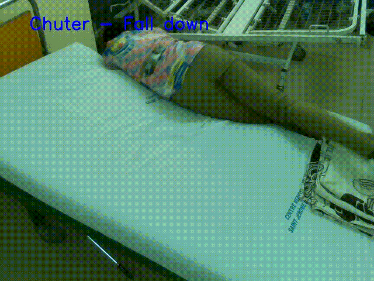

# MOUVEMENT RECOGNITION

This project is a mouvement recognition system designed to assist nurses and doctors in the task of monitoring patient. the model created can recognize a mouvement between 8 differents mouvements in a video


## Acknowledgements

 - [Saint Jerome University](http://www.univ-catho-sjd.cm)
 - [M. Martial Tekinzang](mailto:mtekinzang@univ-catho-sjd.com)
 - [M. Rigobert Fokam](mailto:rfokam@univ-catho-sjd.com)
 - Herman Nguimatsio
 - Marylene Kentsa
 - Evelyne Goueth
 - Dorian Essame
 - Audrey Kwele
 - Lucien Mika
 - Dan Mounpou
 - Falonne Kome
 - Famille Kamokoue


## Authors

- [Nathan Kamokoue](https://github.com/Nathanf22)


## How to Use?
First you must create a new environment for the project.

If not installed, you can install [anaconda](https://www.anaconda.com/products/distribution) or [miniconda](https://docs.conda.io/en/latest/miniconda.html)

once anaconda install, create a new virtual env with the following command
```
$ conda create --name mvt_recognition python=3.8.13
```

make sure to activate this env with the following command

```
$ conda activate mvt_recongnition
```
Navigate in a work directory of your choice using cd
Now create a new folder and move into with the following commands

```
$ mkdir cloned_dir
```

```
$ cd cloned_dir
```

Now clone this repository in your directory
use this
```
$ git clone https://github.com/Nathanf22/Mouvement-Recognition.git
```

or this

```
$ git clone git@github.com:Nathanf22/Mouvement-Recognition.git
```

use the second if you know how to setup ssh

Move into the cloned folder using cd

```
$ cd Mouvement-Recognition
```

install requirements with the folloing command

```
$ pip install -m requirements.txt
```

Download the model [here](https://drive.google.com/file/d/1wN2vFiUG3KeVkALdQNBpYWWJGMfjED6z/view?usp=sharing) and put it in the root diretory of the project, or use the following command to directly download it.

```
$ wget https://drive.google.com/u/2/uc?id=1wN2vFiUG3KeVkALdQNBpYWWJGMfjED6z&export=download
```


To Test this model, execute the test.py file,
Modify the code to test on the differents videos.
I encourage you to add your proper videos and test on it


To add a video, each video must have the following characteristics:

Haved been recorded at 30 fps with a depth camera
must contains exactly 90 frames
the depth map have to be placed in Depth folder with the same name than the rgb video

## Documentation

check a look at this document to understand how the model have been created.

[Documentation](https://docs.google.com/document/d/12VYYn-zQ4zhKqdISunTmt-1i7WpOFjJT/edit?usp=sharing&ouid=117160591050153700060&rtpof=true&sd=true)


## Features

Video with following characteristics:

- Recorded at 30 frames per second
- with size 640*480
- the video must contains 90 frames
- the video must have a depth map video


## Demo
The following vids have been labeled using our model. 




## 🚀 About Me
I'm a Computer science engineer Specialized in machine learning, 2022 graduated from the Saint Jerome Douala University.

These are my Social networks contacts

[LinkedIn](https://www.linkedin.com/in/nathan-kamokoue-1289121b8/);

[](https://twitter.com/KamokoueNathan)

EMail: sikatinathan@gmail.com

Contact me for more informations.


## License

Shield: [![CC BY-NC-SA 4.0][cc-by-nc-sa-shield]][cc-by-nc-sa]

This work is licensed under a
[Creative Commons Attribution-NonCommercial-ShareAlike 4.0 International License][cc-by-nc-sa].

[![CC BY-NC-SA 4.0][cc-by-nc-sa-image]][cc-by-nc-sa]

[cc-by-nc-sa]: http://creativecommons.org/licenses/by-nc-sa/4.0/
[cc-by-nc-sa-image]: https://licensebuttons.net/l/by-nc-sa/4.0/88x31.png
[cc-by-nc-sa-shield]: https://img.shields.io/badge/License-CC%20BY--NC--SA%204.0-lightgrey.svg


